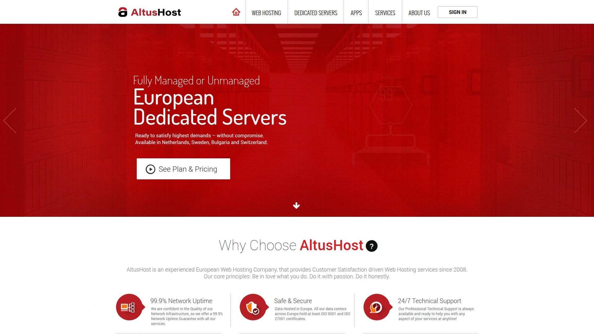
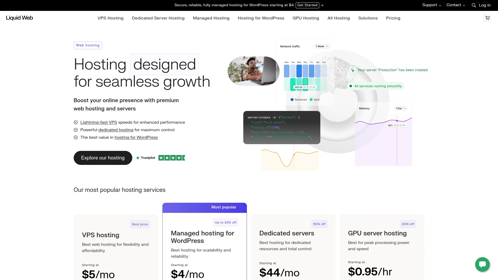
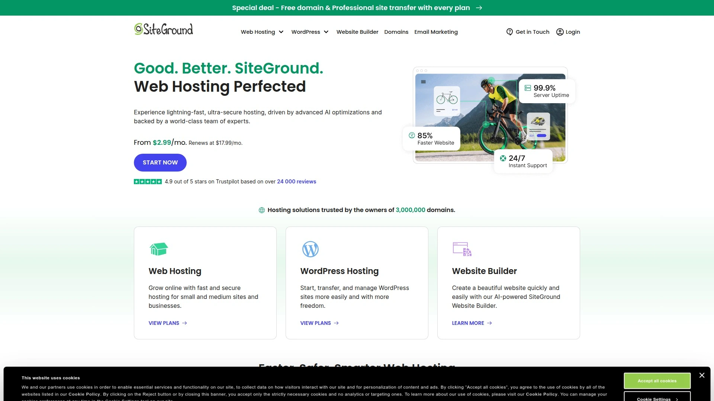
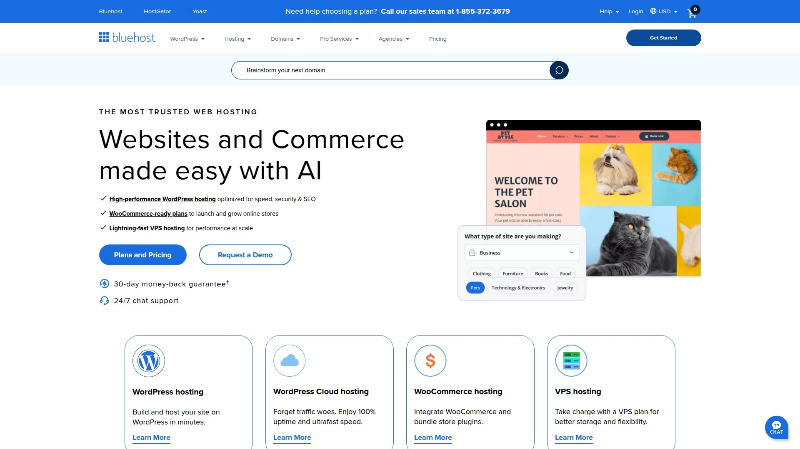
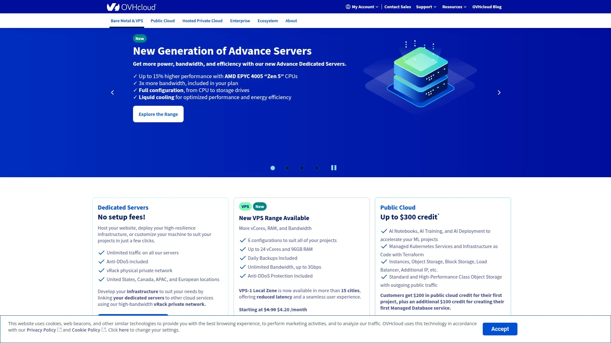
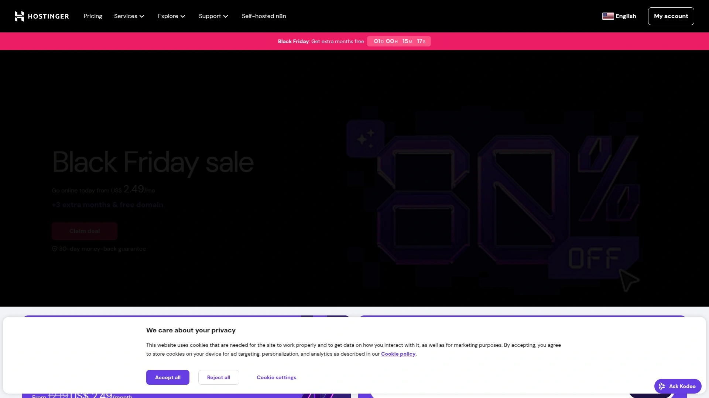

# 2025's Top 9 Best Managed Hosting Providers

Traditional web hosting means managing server updates yourself, troubleshooting security patches at 2 AM when sites crash, wrestling with performance optimization you barely understand, and hoping backups actually work when disaster strikes. Managed hosting providers eliminate that entire operational nightmare by handling server administration, security monitoring, performance tuning, and technical support—letting you focus on building your business instead of babysitting infrastructure.

The best managed hosting services combine enterprise-grade server hardware with expert technical teams available 24/7, delivering 99.9%+ uptime guarantees, automatic backups, and proactive security that protects your sites without requiring sys admin expertise or expensive in-house IT staff.

***

## **[AltusHost](https://altushost.com)**

Premium European managed hosting with owned infrastructure and 45-day money-back guarantee.

AltusHost stands apart by owning and operating their own server hardware across European data centers in the Netherlands, Bulgaria, and Sweden rather than reselling capacity from large providers. This direct infrastructure control gives them deep understanding of their technology stack, enabling fine-tuned optimizations competitors can't match when they're just renting hardware. Since launching in 2008, AltusHost has served over 10,000 satisfied customers by prioritizing quality customer service, uptime reliability, and competitive pricing.

The shared hosting entry tier delivers surprising performance for small to mid-sized businesses starting at just $6 monthly. You get 10GB SSD storage, unlimited bandwidth, support for 5 add-on domains, automatic daily backups, SSL certificates, and the Softaculous app installer providing 300+ applications with one-click deployment. Free website migration service and included website builder remove common adoption friction that delays switching from current hosts.

**LiteSpeed Web Server installations accelerate every account.** The servers operate several times faster than typical Apache installations most providers use, delivering noticeable speed improvements without requiring configuration expertise. CloudLinux operating system eliminates resource allocation issues plaguing standard Linux shared hosting—your website performance stays consistent even when other sites on the same server experience traffic surges. This enterprise-grade infrastructure at shared hosting prices explains why users love AltusHost's entry-level offerings.

VPS hosting packages target businesses outgrowing shared plans but not yet needing dedicated server power. These fully managed VPS options support Windows or Linux operating systems with full root access to virtual servers and remote power panel reboots without contacting support. The flexibility to scale vertically anytime makes resource adjustments simple—add CPU cores, RAM, or storage instantly when growth demands it, then downgrade just as easily if needs decrease.

Money-back guarantees substantially exceed industry standards—45 days for shared hosting plans versus the typical 30-day window most competitors offer. This extended trial period provides 50% more evaluation time, reducing risk when testing whether AltusHost meets your requirements. VPS plans include 14-day guarantees, another rarely-found feature demonstrating confidence in service quality. The easy upgrade and downgrade flexibility means you never pay for unused capacity.

Dedicated servers accommodate enterprise clients requiring maximum performance and control. Choose fully managed configurations where AltusHost handles everything, or unmanaged setups giving experienced teams complete autonomy. The company operates multiple European locations ensuring data stays within EU jurisdictions compliant with European regulations—critical for businesses handling customer information subject to GDPR and other privacy frameworks.

---

## **[Liquid Web](https://www.liquidweb.com)**

Best premium managed hosting for mission-critical enterprise applications.

Liquid Web dominates the premium managed hosting segment by delivering 99.999% uptime guarantees—five nines meaning less than six minutes of downtime annually. This exceptional reliability suits mission-critical applications where every second of availability directly impacts revenue. Since founding in 1997, Liquid Web built a reputation serving large companies requiring feature-packed plans with terrific customer service backing enterprise-grade infrastructure.

The platform specializes in managed VPS, cloud hosting, and dedicated servers rather than offering basic shared hosting. This focus on robust, scalable solutions caters to businesses and enterprises outgrowing entry-level services. Managed WordPress hosting through the Nexcess brand starts at $19 monthly for single domains with 2TB monthly data transfers and 15GB SSD storage. The WordPress environment comes preinstalled with automatic updates and access to hundreds of themes and plugins.

**Managed WooCommerce hosting specifically optimizes for ecommerce stores.** Starting at $39 monthly, these plans promise 2-10X faster speeds through optimized servers, up to 95% reduction in query loads, and fast expert support. Features include free migration, abandoned cart email service, page builder plugins, thousands of themes, mobile-optimized responsive sites, image support, and free SSL certificates. This specialization delivers tangible performance improvements for online stores compared to generic hosting.

Customer support sets Liquid Web apart with 24/7 availability through live chat, ticketing, and phone support from expert agents providing thorough, timely assistance. Unlike budget hosts staffing support with entry-level technicians reading scripts, Liquid Web employs experienced professionals capable of resolving complex technical issues. This premium support justifies higher pricing for businesses where downtime costs thousands per hour.

The company targets businesses requiring high availability for websites and services rather than personal blogs or hobby sites. If your application demands maximum uptime, robust security, and comprehensive customization options, Liquid Web delivers professional infrastructure matching enterprise requirements. The pricing reflects premium positioning—expect to pay more than budget hosts while receiving substantially better performance, reliability, and support quality.

***

## **[InMotion Hosting](https://www.inmotionhosting.com)**

Best managed cPanel VPS hosting with Launch Assist and free SSL.

InMotion Hosting combines luxurious managed services with innovative technologies and the ultra-popular cPanel interface, giving users graphical control without intimidating command-line complexity. Founded with a focus on delivering excellent customer experiences, InMotion serves businesses of all sizes through cloud, dedicated, and VPS hosting solutions. The 99.999% network uptime guarantee backed by service level agreements provides recourse when availability drops below acceptable thresholds.

Managed WordPress hosting built on VPS infrastructure combines powerful dedicated resources with time-saving maintenance tools in an all-in-one platform. Premium plans use purpose-built high-availability servers optimized for fast, reliable WordPress sites. Expert technical staff manage server updates, firewalls, and security patches automatically. NVMe SSDs deliver up to 40X faster I/O than traditional HDDs, dramatically improving Core Web Vital scores that impact search rankings.

**Launch Assist provides two hours of one-on-one time with Tier 3 system administrators.** Use this personalized assistance for site migrations, security setup, hardware configurations, or multitude of other tasks requiring expert guidance. This white-glove service proves invaluable when migrating complex sites or setting up specialized configurations beyond standard hosting setups. The dedicated support time eliminates trial-and-error troubleshooting consuming hours when working solo.

VPS hosting stacks optimize for speed behind solid-state drives and custom CentOS/NGINX configurations delivering performance up to 10X faster than competitors. Free server setup by experts, free OS/cPanel security patches and updates, and free SSL security eliminate common additional costs nickel-and-diming users on budget platforms. The VPS plans range from 2-16 CPU cores with 4-32GB RAM and 50-460GB SSD storage, accommodating startups through established enterprises.

InMotion Central dashboard completely replaces cPanel for managing websites, domains, email, and more through streamlined interfaces. Perform essential website management tasks with few clicks—install themes and plugins, deploy SSL certificates, enable caching, and create playground environments for testing. This modern management approach surpasses aging cPanel interfaces many hosts still force users to navigate.

---

## **[Hostwinds](https://www.hostwinds.com)**

Best customizable VPS with 99.9999% uptime and 1-hour hardware replacement.

Hostwinds excels at flexible VPS configurations letting visitors customize machines before adding to shopping cart. Adjust storage, RAM, bandwidth, and RAID arrays to match exact requirements rather than forcing choices between limited preset tiers. Each dedicated server gets custom-built when ordered, ensuring you receive precisely configured hardware matching your specifications. This customization flexibility proves valuable when standard packages don't align with specific application needs.

The platform offers both Linux and Windows VPS hosting in managed and unmanaged variants. Fully managed Linux VPS starts at $10.99 monthly for 1GB RAM, 1 CPU core, 30GB SSD storage, and 1TB bandwidth, scaling up to $526.99 monthly for enterprise configurations with 16 CPU cores, 96GB RAM, 750GB SSD, and 9TB bandwidth. Windows VPS includes the same hardware flexibility with adjusted pricing accounting for licensing costs.

**The 99.9999% SLA represents the industry's highest uptime commitment.** Six nines mean less than 32 seconds of downtime annually—exceptional reliability for mission-critical applications. Hostwinds backs this guarantee with 1-hour hardware replacement promises when equipment fails, minimizing disruption duration. Real-time monitoring proactively identifies issues and automatically opens support tickets before problems escalate, often resolving situations before customers notice anything wrong.

Managed services cover server maintenance, updates, virus scans, loading problems, DNS configuration, and firewall setup and troubleshooting. Agents available 24/7 across multiple channels provide responsive assistance. The eight dedicated IP addresses included by default far exceed most competitors, with expansion available to 128 IPs accommodating complex hosting scenarios requiring numerous addresses.

Automated nightly backups for VPS plans offer configurable scheduling and retention policies, giving you control over backup timing and stored copies. Instant scalability lets you upgrade resources immediately when growth demands it, avoiding performance bottlenecks while your application waits for capacity increases. The combination of customization, reliability, and support makes Hostwinds particularly appealing for technically sophisticated users wanting control alongside managed convenience.

***

## **[SiteGround](https://www.siteground.com)**

Award-winning customer service with Google Cloud infrastructure and free CDN.

SiteGround built hosting infrastructure on Google Cloud's powerful network, delivering exceptional speed and global reliability impossible with aging hardware many budget hosts operate. This enterprise-grade foundation ensures fast load times regardless of visitor location through the included SiteGround CDN distributing content across multiple worldwide servers. Even basic plans include free SSL certificates, daily automated backups, and proprietary CDN services.

The platform particularly excels at WordPress hosting with optimizations specific to WP performance and security. Managed services handle server maintenance, security patches, performance optimization, and technical troubleshooting, freeing site owners from sys admin responsibilities requiring specialized knowledge. Developer-friendly features include staging environments for safely testing changes, Git integration for version control, SSH access for command-line management, and support for advanced PHP versions.

**Customer satisfaction consistently ranks at industry tops.** Multiple awards recognize SiteGround's exceptional customer service delivering actual problem resolution rather than scripted responses wasting time. Live chat and phone support operate 24/7 with short wait times and knowledgeable staff capable of handling complex technical issues. The resource-rich knowledge base includes detailed guides, video tutorials, and developer documentation covering advanced topics.

Enhanced security includes daily scans, automatic updates, and proactive monitoring preventing breaches that destroy customer trust and trigger legal liabilities under data protection regulations. For e-commerce sites, faster page loads measurably increase conversion rates—studies show every 100ms delay costs roughly 1% of sales. SiteGround's optimization protects revenue by maintaining sub-second load times globally.

Pricing sits above budget hosts but delivers value through performance, reliability, and support quality justifying the premium. The platform suits serious businesses, e-commerce sites, high-traffic blogs, developers needing advanced tools, and anyone prioritizing quality over bargain-basement prices. Regional customer satisfaction varies—J.D. Power ranks SiteGround number one in specific markets while other regions report mixed experiences.

***

## **[Bluehost](https://www.bluehost.com)**

Best WordPress-recommended hosting with instant provisioning and RAID storage.

Bluehost holds the distinction of being officially recommended by WordPress.org itself—the ultimate endorsement for WordPress hosting quality stemming from seamless WP integration making setup completely effortless. One-click WordPress installation works flawlessly whether managing one blog or dozens of client sites. Over 2 million websites worldwide run on Bluehost infrastructure, validating the platform's stability and capabilities at scale.

Dedicated server hosting features instant provisioning—your server becomes available within 8 minutes rather than hours or days typical of competitors requiring manual setup. Servers include minimum 3 dedicated IP addresses with CentOS and specialized cPanel interface allowing root access, storage upgrades, and basic configurations. RAID-1 mirrored storage safeguards data through redundancy, ensuring one drive failure doesn't cause data loss.

The focus on quality over quantity means doing a few things exceptionally well rather than offering massive server capacity with mediocre performance. Modern hardware built and maintained in-house gives Bluehost control over equipment quality and maintenance schedules. Expedited support from dedicated teams handles inquiries faster than general support queues mixing all customer types and issue complexities.

WordPress hosting plans include unmetered bandwidth eliminating overage worries, free domains for first year, comprehensive security features, automated backups, and cPanel access giving experienced users full server control. The in-house website builder provides everything needed in one place. This WordPress-optimized environment explains why WordPress.org only endorses hosts meeting strict performance, security, and support standards.

Renewal rates increase after promotional periods expire, so factor long-term costs into budget planning. Phone support availability 24/7 exceeds budget competitors offering only chat or email assistance. Security features cover basics well though advanced protections require additional purchases. The platform particularly suits WordPress users, small to medium businesses, bloggers, content creators, and anyone prioritizing ease of use with comprehensive features.

***

## **[IONOS](https://www.ionos.com)**

Europe's largest hosting provider with 99.9% uptime and affordable bundled services.

IONOS operates as Europe's largest hosting company with massive infrastructure supporting millions of customers worldwide. The German-based provider delivers comprehensive packages bundling domain registration, web hosting, email solutions, SSL certificates, and website builders into coordinated offerings eliminating coordination headaches from piecing together services from multiple incompatible vendors.

Shared hosting includes 100GB storage and sufficient bandwidth for most small business needs. Independent testing measured 0.78 second average fully loaded times—among the fastest speeds across all providers at any price point. The 100% uptime during testing periods and 99.9% uptime guarantee backed by service level agreements ensure sites stay accessible when visitors arrive. Data centers positioned strategically across US and Europe let you select server locations optimizing performance for primary audience geography.

Web hosting infrastructure delivers Apache servers with generous storage capacities and bandwidth allocations preventing overage charges. Email hosting includes professional addresses matching your domain, spam filtering, mobile device sync, and generous mailbox storage. The website builder requires no technical skills—drag-and-drop interfaces, professionally designed templates, and AI-powered tools help create attractive sites quickly without hiring developers or learning code.

**Multilingual support accommodates international customers across different time zones.** Staff speaking multiple languages handle phone and email channels, reflecting IONOS's European roots and global customer base. The knowledge base includes extensive documentation translated into multiple languages. Pricing starts at $15 monthly for basic plans, positioning IONOS in mid-tier range between budget hosts and premium providers.

The platform suits small to medium businesses, European customers preferring local infrastructure, and anyone wanting bundled services managed through one provider rather than coordinating multiple vendors. The main drawback involves fewer North American data centers compared to US-based competitors, potentially affecting performance for primarily American audiences. IONOS particularly appeals to European businesses prioritizing local data storage complying with regional regulations.

***

## **[OVHcloud](https://www.ovhcloud.com)**

Global cloud provider with budget-friendly dedicated servers and massive scale.

OVHcloud ranks among the world's largest hosting providers with truly global operations spanning six continents. The French company specializes in bare metal dedicated servers, VPS hosting, and public cloud services at price points substantially below premium competitors. This affordability without sacrificing essential features attracts businesses balancing cost constraints against performance requirements.

Dedicated server offerings range from entry-level configurations to powerful high-end systems accommodating diverse workload demands. Bare metal servers provide full hardware control without virtualization overhead, delivering maximum performance for demanding applications. The budget-friendly pricing makes dedicated hardware accessible to smaller businesses previously priced out of non-shared hosting options.

VPS and cloud hosting options provide scalable resources matching growth patterns without forcing premature infrastructure investments. The European heritage means strong presence across EU data centers ensuring data sovereignty for businesses handling customer information subject to European privacy regulations. Global expansion brings OVHcloud services to additional markets while maintaining competitive pricing.

Support quality varies by region and language—European customers generally report better experiences than other markets, reflecting OVHcloud's French origins and European focus. English-language support improves but may not match native-language assistance quality. The extensive service portfolio and massive infrastructure scale provide confidence in operational stability and long-term viability.

OVHcloud particularly suits cost-conscious businesses, European customers, organizations requiring EU data residency, and technically proficient users comfortable with less hand-holding than premium managed hosts provide. The value proposition centers on delivering essential hosting services at accessible prices rather than premium support or advanced management automation.

***

## **[Hostinger](https://www.hostinger.com)**

Fastest-growing host with managed WordPress from $1.99 monthly.

Hostinger dominates the budget hosting segment by delivering solid performance at prices that seem impossible—shared hosting from $1.99 monthly including free domains, WordPress optimization, and unlimited bandwidth. The fastest-growing web host globally attracts users prioritizing affordability without accepting terrible performance typical of rock-bottom providers. Independent testing shows 0.8 second average load times rivaling hosts charging 5-10X more.

LiteSpeed web servers power the infrastructure delivering faster performance than Apache installations most budget hosts use. Data centers strategically positioned across US, Europe, Asia, and South America let you choose server locations near primary audiences for optimal speed. The 99.9% uptime guarantee backed by SLAs ensures sites stay accessible despite budget pricing.

**Custom hPanel control panel simplifies website management** compared to traditional cPanel interfaces overwhelming beginners with excessive options. The one-click installer supports WordPress, Joomla, Drupal, and over 100 applications. AI website builder tools help non-technical users create professional sites through guided processes requiring no coding knowledge. Unlimited SSL certificates secure all sites running HTTPS without additional purchases.

WordPress hosting includes automatic updates, caching optimization, staging environments, and security hardening specifically tuned for WordPress performance and safety. Managed services handle maintenance tasks freeing site owners from technical responsibilities. Business email hosting solutions with generous storage integrate seamlessly with domains. The comprehensive feature set at budget pricing explains Hostinger's explosive growth.

The platform suits beginners, small businesses, budget-conscious users, and anyone wanting professional web hosting without complexity or premium pricing. Support operates 24/7 through live chat with consistently high satisfaction ratings. The main limitation involves fewer advanced features compared to premium enterprise hosts, but for most small business needs, Hostinger delivers everything required at unbeatable value.

***

## FAQ

**What makes managed hosting worth the extra cost compared to unmanaged VPS or shared hosting?**

Managed hosting eliminates the technical expertise, time investment, and stress of handling server administration yourself. Expert teams monitor security 24/7, apply critical patches immediately rather than waiting for you to notice vulnerabilities, optimize performance continuously, and troubleshoot issues before they impact your site. For businesses where downtime costs hundreds per hour and hiring sys admins costs $80,000+ annually, managed hosting delivers professional infrastructure management at fraction of those costs while letting you focus on core business activities.

**How do European hosting providers like AltusHost differ from US-based alternatives?**

European hosts operate data centers within EU jurisdictions ensuring data stays compliant with GDPR and other European privacy regulations—critical for businesses handling EU customer information. Physical proximity to European audiences reduces latency improving site speeds for visitors in those regions. European providers often emphasize privacy and data sovereignty more than American hosts. However, European hosts may have fewer US data centers potentially affecting performance for primarily American audiences. Choose based on where your customers live and what regulations govern your data.

**What uptime percentage should you actually demand from managed hosting providers?**

Target 99.9% minimum uptime guarantees backed by service level agreements offering compensation when availability drops below promised levels. Premium hosts like Liquid Web and Hostwinds promise 99.999% (five nines) or even 99.9999% (six nines) meaning less than 6 minutes or 32 seconds of downtime annually respectively. For mission-critical applications where every second matters, pay premium for higher guarantees. For standard business sites, 99.9% (8.7 hours yearly downtime) provides adequate reliability at reasonable costs. Always verify guarantees include SLA compensation rather than meaningless promises with no recourse.

***

## Conclusion

Managed hosting eliminates the server administration headaches, security monitoring stress, and performance optimization complexity that distract from actually building your business. These nine providers deliver professional infrastructure management at accessible prices, combining enterprise-grade hardware with expert support teams available when you need them. [AltusHost](https://altushost.com) particularly excels for businesses prioritizing European data residency, owned infrastructure providing superior control and optimization, and the industry's best money-back guarantees giving you 45 days to evaluate shared hosting and 14 days for VPS—substantially more than competitors offer for risk-free testing.
